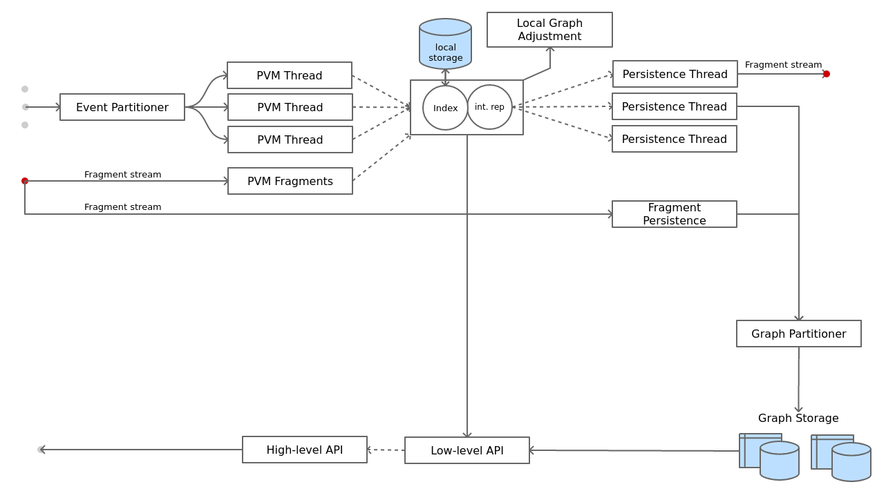

# libopus Exploration

## Implementations
* Rust - Active
* Go - Inactive
* C++ - Inactive

## Test-harness
Inactive

## Design

* [C API](opus.h)
* [PVM Fragments](pvm-ops.md)
* [Neo4J Fragments](neo4j.md)